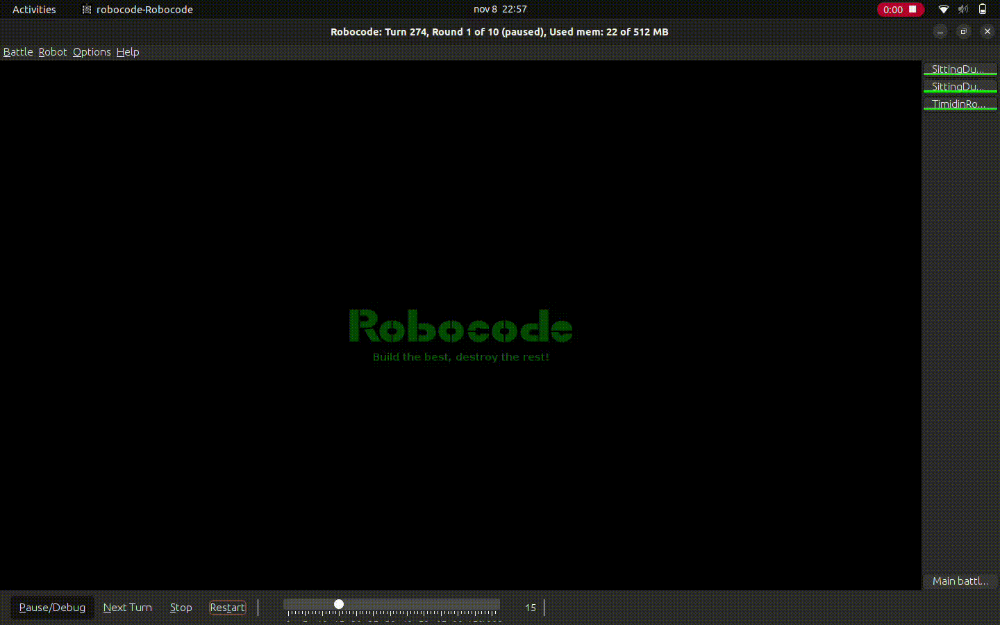

# Proyecto Robocode

## Introducción
Este proyecto utiliza **Robocode**, un entorno de programación en Java para el desarrollo de robots autónomos que compiten en batallas simuladas. El objetivo de este proyecto es explorar y aplicar estrategias de evasión, sincronización y combate en un campo de batalla. Se han desarrollado dos lógicas distintas para los robots:

1. **Robot Esquina**: Un robot individual el cual primeramente detecta con el radar a un enemigo, y calcula la esquina más lejana a ese enemigo, después se dirige a ella esquivando y disparando a los enemigos que haya por en medio.


3. **Equipo sincronizado con líder**: Un equipo de robots donde se elige un líder y todos los demás lo siguen, manteniendo la trayectoria rectangular. Además, cuando se detecta a un enemigo, todos los robots del equipo apuntan y disparan de manera coordinada.


## Tabla de Contenidos
- [Instalación](#instalación)
- [Uso](#uso)
- [Características](#características)
- [Dependencias](#dependencias)
- [Documentación](#documentación)
  
## Instalación
1. **Requisitos previos**:
   - [Java Development Kit (JDK) 8 o superior](https://www.oracle.com/java/technologies/javase-jdk11-downloads.html).
   - [Robocode](https://robocode.sourceforge.io/) instalado y configurado.

2. **Clonación del proyecto**:
   ```bash
   git clone https://github.com/Markuus9/Robocode.git
   cd Robocode

## Uso
1. Inicia Robocode y selecciona los robots que deseas probar.
2. En la selección de batalla, elige el robot individual o el equipo sincronizado.
3. Observa cómo cada robot aplica la lógica.

## Características
**· Robot esquina:** Posee 4 fases: 
1. Detección del enemigo mediante la rotación del radar, y cálculo de la esquina más lejana al enemigo.
2. Posicionamiento y desplazamiento del robot hacia la respectiva esquina, esquivando los enemigos/obstáculos.
3. Una vez colocado en la esquina detecta a enemigos, los fija y dispara!!
**· Equipo Robot:** Posee 2 fases:
1. En esta fase inicial, se decide una jerarquía entre los tanques: Team Leader, segundo, tercero, cuarto, quinto. La elección del TeamLeader (TL) se hace de forma aleatoria, siendo necesario que los robots lo consensúen. Posteriormente, la jerarquía se establece por distancias. El robot más cercano al TL es el segundo, el robot más cercano al segundo es el tercero, etc.
2. El TL sigue una ruta rectangular fija alrededor del campo de batalla esquivando a todos los enemigos. Inicialmente calculará la esquina más cercana y se dirigirá en línea recta. Si muere el TL, el segundo será TL. En cuanto al resto de robots que no son TL, cada robot sigue a su antecesor (p.ej. el tercero sigue al segundo). Si muere el antecesor debemos seguir al inmediatamente anterior (siguiendo el ejemplo, si muere el segundo, seguiremos al primero). Mientras los robots siguieron en el TL, van disparando todos al mismo enemigo. Si el enemigo muere, se consensúa quién será el próximo enemigo a batir. Cada 15 segundos se invierten los roles del equipo y el sentido de rotación (el último pasa a ser el TL y gira en sentido contrario).
    
## Dependencias
· Java JDK 8 o superior: Lenguaje de programación en el cual están desarrollados los robots.
· Robocode: Plataforma de simulación para la batalla de robots autónomos.

## Documentación
El proyecto trae implementado un javadoc con la explicación de todo el código (utilización de variables, funcionamiento funciones, clases, parámetros, etc).
